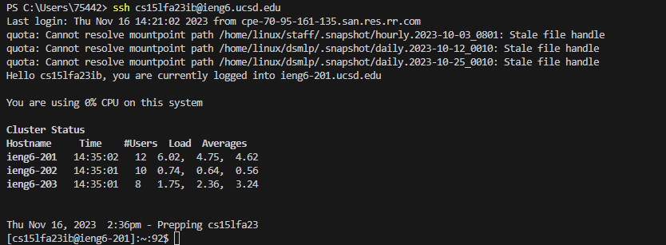
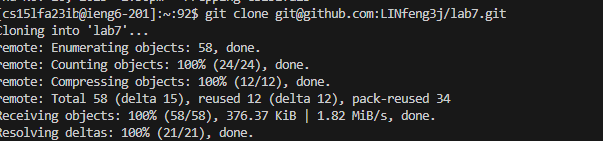
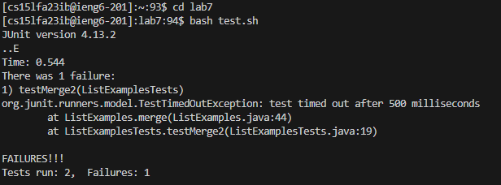
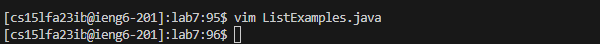
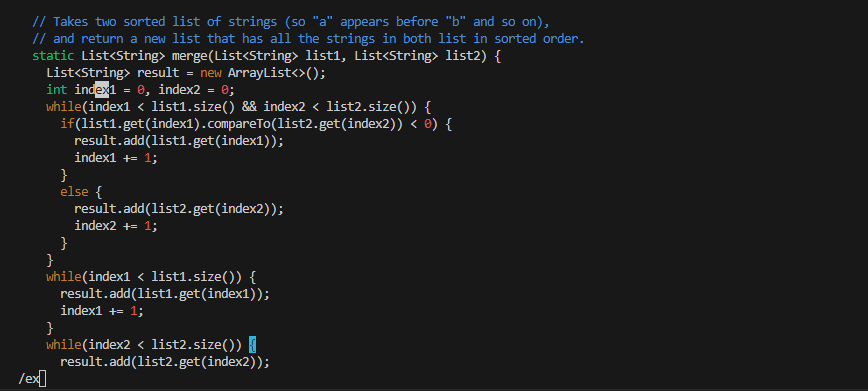
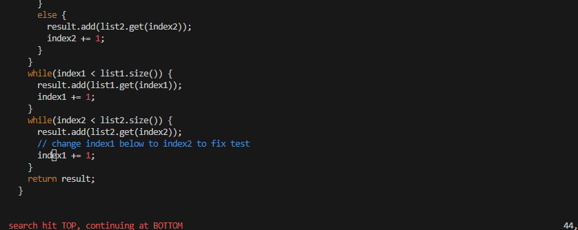
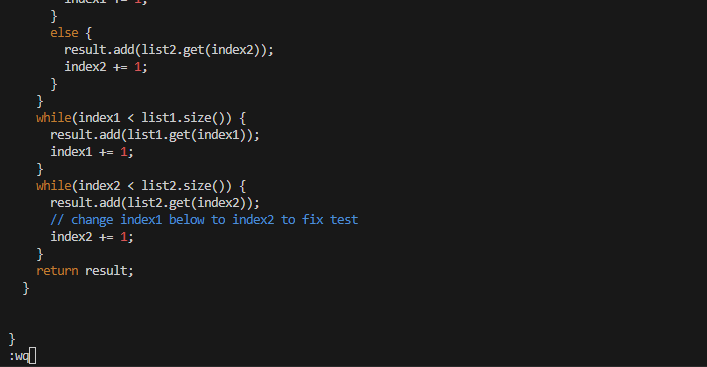
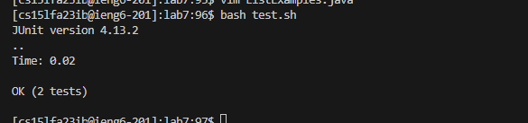
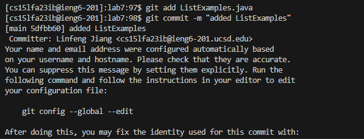
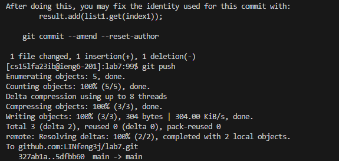

# Lab Report4
Step 4. Log into ieng6 <br>
 <br>
````
Keypressed：<up><enter>
````
__Because I was operating in ieng6 in the previous step in the visual studio terminal, I found the ssh ieng6 command using one upper key to find it, and the key from week three helped me to enter ieng6 without passwords.__ <br>

Step 5. Clone your fork of the repository from your GitHub account (using the SSH URL)<br>
 <br>
````
KeyPressed：git<space>clone<space><ctrl-v><enter>
````
__Because I deleted the fork and repository, I did not use the previous command but re-entered the git clone and copied and pasted the new URL.__ <br>

Step 6. Run the tests, demonstrating that they fail <br>
 <br>
````
KeyPressed: cd <space> lab7
````
__Since it is short, I didn't use search history to find it. Type out go into that directory__ <br>
````
KeyPressed: <up><up><up><up><up><enter>
````
__The bash command for the test. sh was five up in the history, So I used the up arrow to access it.__ <br>

Step 7. Edit the code file to fix the failing test <br>
 <br>
````
KeyPressed: <up><up><up><up><up><up><up><enter>
````
__The vim command for ListExamples.java is seven up in the search history, So I also used the up arrow to access it and get into vim editor mode__ <br>
 <br>

````
KeyPressed: /ex<enter>N(notice I use upper n so it repeats the search in the opposite direction, which leads me to the wrong index)
 <br>
````

````
KeyPressed:er2
````
__I used /ex to search for ex, which in this file is all the string index, and N to go to the next opposite direction and search for which is the last index that we need to fix, e is for the jump to the last digit of the word, and r is to change that single character to 2.__ <br>
 <br>
````
KeyPressed::wq<enter>
````
__wq for saving what I changed and quit the vim editor, so now the file has been save__ <br>

step8.Run the tests, demonstrating that they now succeed
 <br>
````
KeyPressed:<up><up><enter>
````
__Since we can see, we just did the tesh before the change, so it is just two up commands above__

step9.Commit and push the resulting change to your GitHub account (you can pick any commit message!)<br>
 <br>
````
KeyPressed:<up><up><up><up><up><enter> or git<space>add<space>ListExamples.java<enter>
````
 <br>
````
KeyPressed:<up><up><up><up><up><enter> or git<space>commit<space>-m<space>"added ListExamples"<enter>
````
````
KeyPressed:<up><up><up><up><up><enter> or git<space>push<enter>
````
__Since we keep trying to make these steps faster, the command is not far from the search history. But in normal cases, I still need to git commit and push command on my own, so I also include that case. This command is for uploading to the GitHub repository using the ssh key URL,and since I have made the key to my GitHub, it will work.__


